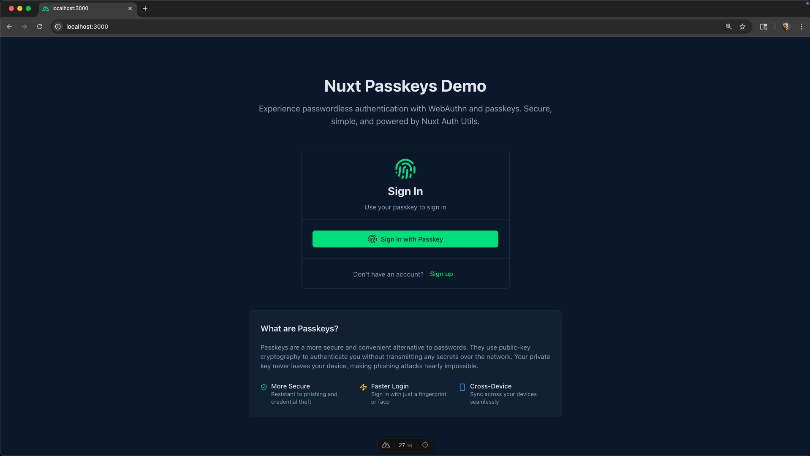
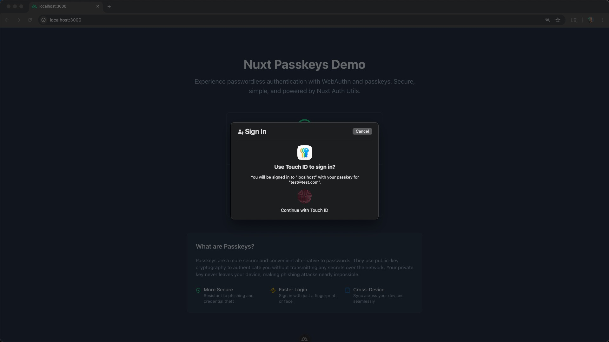
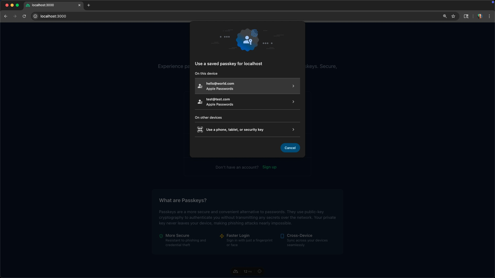

# Passkeys in Nuxt - The BEST Login UX

This guide walks you through what passkeys are, why they matter, and how to implement a full passkey (WebAuthn) auth flow in Nuxt 4 using Nuxt Auth Utils, Drizzle ORM (SQLite/libSQL), and Nuxt UI.

TLDR: [Checkout the repo here](https://github.com/danielkellyio/nuxt-auth-passkeys-example) and try it out for yourself!

## What are Passkeys and Why Use Them?

Passkeys are a modern, passwordless authentication method based on public‑key cryptography. Instead of storing passwords on servers and asking users to remember them, passkeys let users authenticate with their device’s biometric or screen lock. The private key never leaves the user’s device, which makes passkeys:

- More secure: resistant to phishing and credential stuffing.
- Simpler and faster: no passwords to remember or type.
- Cross‑device capable: synced safely via a platform’s secure mechanisms.

For a friendly, high‑level overview, [checkout passkeys.dev](https://passkeys.dev/).

If you want a deeper dive into building authentication systems in Nuxt (including passkeys, email/password login, social logins, and more), check out the course: [Nuxt Auth Utils: Secure, Simple, and Flexible Logins](https://vueschool.io/courses/nuxt-auth-utils-secure-simple-and-flexible-logins).

## Build a Passkey Auth Flow in Nuxt 4

Here's a high-level overview of what we'll build step by step in this article:

1. First, we'll setup the project with Drizzle, Nuxt Auth Utils, and Nuxt UI.
2. Then, we'll create a simple UI to register a passkey and sign in with it.
3. Finally, we'll store and verify credentials with Nuxt Auth Utils built in server side event handlers and set the user session.

### 1) Setup the Nuxt Project and Install Dependencies

In step 1, let's get the project booted up. Starty by initializing a new Nuxt 4 project with the following command:

```bash
npm create nuxt@latest
```

Then, follow the prompts to create a new project called `nuxt-passkeys`. Make sure to select `@nuxt/ui` when asked about including official modules.

[IMG: nuxt-project-setup-prompt]

We also need to install [nuxt auth utils](https://github.com/atinux/nuxt-auth-utils) and some peer dependencies for passkeys. While not technically an "official" Nuxt module, it is created and maintained by [Sebastien Chopin (Atinux)](https://x.com/Atinux), the creator of Nuxt.

```bash
npm install nuxt-auth-utils @simplewebauthn/server@11 @simplewebauthn/browser@11
```

Make sure to register the module and enable WebAuthn in `nuxt.config.ts`:

```typescript
// nuxt.config.ts
export default defineNuxtConfig({
  //...
  modules: ["@nuxt/ui", "nuxt-auth-utils"],
  auth: {
    webAuthn: true,
  },
});
```

### 2) Database schema and access with Drizzle

For passkeys to work, we need to store users and their passkey credentials. This will require a persistent storage layer on the backend. We'll use [Drizzle ORM](https://orm.drizzle.team/) and [libSQL (an SQLite compatible database)](https://libsql.org/) to do this.

Here’s the Drizzle schema with proper relations and fields required for passkeys (WebAuthn):

```typescript
import {
  sqliteTable,
  text,
  integer,
  primaryKey,
} from "drizzle-orm/sqlite-core";
import { relations } from "drizzle-orm";
import type { WebAuthnCredential } from "#auth-utils";

// Define the "users" table schema
// Each user has a unique integer ID and a required email address
export const users = sqliteTable("users", {
  id: integer("id").primaryKey(), // Primary key: user ID
  email: text("email").notNull(), // User email (must be present)
});

// Define the "credentials" table schema
// Stores WebAuthn credentials for each user
export const credentials = sqliteTable(
  "credentials",
  {
    // Foreign key: links credential to a user, cascades on user deletion
    userId: integer("user_id")
      .references(() => users.id, { onDelete: "cascade" })
      .notNull(),
    // Credential ID (unique per credential)
    id: text("id").notNull().unique(),
    // Public key for the credential
    publicKey: text("public_key").notNull(),
    // Signature counter for replay protection
    counter: integer("counter").notNull(),
    // Whether the credential is backed up (boolean stored as integer)
    backedUp: integer("backed_up", { mode: "boolean" }).notNull(),
    // Supported transports (JSON array, e.g. ["usb", "nfc"])
    transports: text("transports", { mode: "json" })
      .notNull()
      .$type<WebAuthnCredential["transports"]>(),
  },
  // Composite primary key: (userId, id) ensures uniqueness per user
  (table) => [primaryKey({ columns: [table.userId, table.id] })]
);

// Define relation: each credential belongs to one user
export const credentialsRelations = relations(credentials, ({ one }) => ({
  user: one(users, {
    fields: [credentials.userId],
    references: [users.id],
  }),
}));

// Define relation: each user can have many credentials
export const usersRelations = relations(users, ({ many }) => ({
  credentials: many(credentials),
}));
```

Next, let's setup the database connection with drizzle config.

```typescript
// @/drizzle.config.ts
import { defineConfig } from "drizzle-kit";

export default defineConfig({
  schema: "./server/database/schema.ts",
  out: "./server/database/migrations",
  dialect: "sqlite",
  dbCredentials: {
    url: "file:.data/db.sqlite",
  },
});
```

Then create a function for connecting to the database from the app.

```typescript
// @/server/database/index.ts
import { drizzle } from "drizzle-orm/libsql";
import { createClient } from "@libsql/client";
import * as schema from "./schema";

const client = createClient({
  url: process.env.DATABASE_URL || "file:.data/db.sqlite",
});

const db = drizzle(client, { schema });

export const useDB = () => db;
```

We can use a Nitro plugin to run migrations automatically in development:

```typescript
// @/server/plugins/migrations.ts
import { runMigrations } from "../utils/migrate";

/**
 * Server plugin to run database migrations on startup
 */
export default defineNitroPlugin(async () => {
  if (process.env.NODE_ENV === "development") {
    const { runMigrations } = await import("../utils/migrate");
    await runMigrations();
  }
});
```

And the migration runner:

```typescript
// @/server/utils/migrate.ts
import { migrate } from "drizzle-orm/libsql/migrator";
import { useDB } from "../database";
import { mkdirSync } from "fs";
export async function runMigrations() {
  try {
    // Ensure the .data directory exists
    mkdirSync(".data", { recursive: true });

    const db = useDB();

    // Run migrations
    await migrate(db, {
      migrationsFolder: "./server/database/migrations",
    });

    console.log("✅ Database migrations completed");
  } catch (error) {
    console.error("❌ Database migration failed:", error);
  }
}
```

### 4) Client‑side: Register and Sign‑In with passkeys

With initial setup out of the way, let's build the client‑side components for registering and signing in with passkeys.

### Registration component

Nuxt Auth Utils exposes `useWebAuthn()` on the client to trigger the browser’s WebAuthn flows. We can use that along with `useUserSession()` composable from Nuxt Auth Utils, and Nuxt UI to create a passkey registration form. The registration component will:

- Validate email with `zod`.
- Calls `register({ userName: email })` from `useWebAuthn()` on form submit.
- Refreshes the user session with `const { fetch: fetchUserSession } = useUserSession()` on success.

```html
<!-- @/app/components/PassKeyRegister.vue -->
<script setup lang="ts">
  import { z } from "zod";

  const { register } = useWebAuthn();
  const { fetch: fetchUserSession } = useUserSession();
  const error = ref("");
  const loading = ref(false);

  const schema = z.object({
    email: z.pipe(z.string(), z.email("Invalid email")),
  });

  const state = reactive({
    email: "",
  });

  /**
   * Register a new passkey
   * Creates a user and stores their passkey credential
   */
  async function onSubmit() {
    loading.value = true;
    error.value = "";

    try {
      // Call the WebAuthn register endpoint with user info
      await register({
        userName: state.email,
      });

      await fetchUserSession();
      // eslint-disable-next-line @typescript-eslint/no-explicit-any
    } catch (err: any) {
      error.value = err.data?.message || "Failed to register passkey";
    } finally {
      loading.value = false;
    }
  }
</script>

<template>
  <UForm :schema="schema" :state="state" class="space-y-4" @submit="onSubmit">
    <UFormField label="Email" name="email">
      <UInput v-model="state.email" class="w-full" />
    </UFormField>

    <UButton block type="submit">Create Passkey</UButton>
  </UForm>
</template>
```

### Sign‑In component

The sign-in component is much like the registration component, but instead of calling `register()`, we call `authenticate()` from `useWebAuthn()`. This component:

- Calls `authenticate()` to prompt the passkey selector.
- Refreshes the user session on success.



It does not require a form, just a button to trigger the passkey selector. If the user has only one passkey stored for the domain, it will show the biometric/screen lock prompt immediately.



If the user has multiple passkeys stored for the domain, it will show a selector that lets them choose which passkey to use \*.



\*Optionally, you can pass a `userName` to the `authenticate()` function to specify the user to authenticate. This skips the selector and shows the biometric/screen lock prompt immediately even if the user has multiple passkeys for the domain.

Here is the code for that sign-in component.

```html
<!-- @/app/components/PassKeyLogin.vue -->
<script setup lang="ts">
  const { authenticate } = useWebAuthn();
  const { fetch: fetchUserSession } = useUserSession();
  const loading = ref(false);
  const error = ref("");

  /**
   * Authenticate with existing passkey
   * Prompts user to select a passkey credential
   */
  async function handleAuthenticate() {
    loading.value = true;
    error.value = "";

    try {
      // Call the WebAuthn authenticate endpoint
      // optionally pass username to skip the selector
      // would require an input field to get the username/email
      // await authenticate('the username/email here');
      await authenticate();

      await fetchUserSession();
      // eslint-disable-next-line @typescript-eslint/no-explicit-any
    } catch (err: any) {
      error.value = err.data?.message || "Failed to authenticate";
    } finally {
      loading.value = false;
    }
  }
</script>

<template>
  <!-- Authentication (no form needed, just use the passkey) -->
  <div class="space-y-4">
    <UAlert
      v-if="error"
      color="error"
      icon="i-lucide-alert-circle"
      :title="error"
    />

    <UButton
      block
      size="lg"
      icon="i-lucide-fingerprint"
      :loading="loading"
      @click="handleAuthenticate"
    >
      Sign In with Passkey
    </UButton>
  </div>
</template>
```

### Composed auth card and UI

With the registration and sign-in components out of the way, we can create an auth card to easily switch between them.

```html
<!-- @/app/components/PasskeyAuth.vue -->
<script setup lang="ts">
  const mode = ref<"signin" | "signup">("signin");
  const error = ref("");

  function toggleMode() {
    mode.value = mode.value === "signin" ? "signup" : "signin";
    error.value = "";
  }
</script>

<template>
  <UCard class="w-full max-w-md">
    <template #header>
      <div class="flex flex-col items-center space-y-2">
        <UIcon name="i-lucide-fingerprint" class="size-12 text-primary" />
        <h2 class="text-2xl font-bold">
          {{ mode === "signin" ? "Sign In" : "Sign Up" }}
        </h2>
        <p class="text-sm text-muted">
          {{ mode === "signin" ? "Use your passkey to sign in" : "Create a new
          passkey account" }}
        </p>
      </div>
    </template>

    <!-- Registration Form -->
    <PassKeyRegister v-if="mode === 'signup'" />
    <PassKeyLogin v-else />
    <template #footer>
      <div class="text-center text-sm text-muted">
        {{ mode === "signin" ? "Don't have an account?" : "Already have an
        account?" }}
        <UButton variant="link" @click="toggleMode">
          {{ mode === "signin" ? "Sign up" : "Sign in" }}
        </UButton>
      </div>
    </template>
  </UCard>
</template>
```

The auth card is useful for showing unauthenticated users but what about authenticated users? No worries! We can create a user display component to show the authenticated user and provide logout functionality.

```html
<!-- @/app/components/UserDisplay.vue -->
<script setup lang="ts">
  /**
   * User Display Component
   *
   * Shows the current logged-in user information
   * and provides logout functionality
   */

  const { user, loggedIn, clear } = useUserSession();
  const toast = useToast();
  const loading = ref(false);

  /**
   * Logout the current user
   */
  async function handleLogout() {
    loading.value = true;
    try {
      await clear();

      toast.add({
        title: "Logged out",
        description: "You have been logged out successfully.",
        color: "success",
      });
    } catch {
      toast.add({
        title: "Error",
        description: "Failed to logout",
        color: "error",
      });
    } finally {
      loading.value = false;
    }
  }
</script>

<template>
  <div v-if="loggedIn && user" class="w-full max-w-md">
    <UCard>
      <template #header>
        <div class="flex items-center space-x-3">
          <UAvatar :alt="user?.name" size="lg">
            <template #fallback>
              <UIcon name="i-lucide-user" class="size-6" />
            </template>
          </UAvatar>
          <div class="flex-1">
            <h3 class="font-semibold">{{ user.email }}</h3>
            <p class="text-sm text-muted" />
          </div>
        </div>
      </template>

      <div class="space-y-3">
        <div class="flex items-center space-x-2 text-sm">
          <UIcon name="i-lucide-fingerprint" class="size-4 text-primary" />
          <span class="text-muted">Secured with passkey</span>
        </div>

        <div class="flex items-center space-x-2 text-sm">
          <UIcon name="i-lucide-check-circle" class="size-4 text-success" />
          <span class="text-muted">Authentication successful</span>
        </div>
      </div>

      <template #footer>
        <UButton
          block
          color="neutral"
          variant="outline"
          icon="i-lucide-log-out"
          :loading="loading"
          @click="handleLogout"
        >
          Logout
        </UButton>
      </template>
    </UCard>
  </div>
</template>
```

Finally, we can create a landing page that will show the auth card for unauthenticated users and the user display for authenticated users conditionally based on the user session.

```html
<!-- @/app/pages/index.vue -->
<script setup lang="ts">
  const { loggedIn } = useUserSession();
</script>

<template>
  <UMain>
    <UContainer
      class="flex flex-col items-center justify-center min-h-screen py-12"
    >
      <div class="w-full flex justify-center">
        <!-- Show auth form for guests -->
        <PasskeyAuth v-if="!loggedIn" />

        <!-- Show user info for authenticated users -->
        <UserDisplay v-else />
      </div>

      <PassKeyInfo />
    </UContainer>
  </UMain>
</template>
```

### 4) Server‑side: WebAuthn endpoints (register and authenticate)

The UI looks great but isn't functional quite yet. The last step is to implement the WebAuthn endpoints on the server.

Nuxt Auth Utils provides helpers to make this easy. You just need to implement the following two endpoints:

### The WebAuthn Register Endpoint (`/api/webauthn/register`)

Here's the breakdown of what this endpoint does:

1. Validates the `userName` (email in our case) the user provided on registration.
2. Creates a user if needed.
3. Saves the credential and associates it with the user.
4. Sets the user session (user is logged in!)
5. Bonus: Checks if the user is already authenticated and the registration email matches the email in the session. (if so, it will just link the credential to the user). This makes it easy to both register new users and link credentials to existing users.

Here is the code for the register endpoint. NOTE that the endpoints use auto imported helper functions defined in `@/server/utils/user.ts` and `@/server/utils/credential.ts` to interact with the database. You can see these function definitions in the github repo linked here:

- [@/server/utils/user.ts](https://github.com/danielkellyio/nuxt-auth-passkeys-example/blob/main/server/utils/user.ts)
- [@/server/utils/credential.ts](https://github.com/danielkellyio/nuxt-auth-passkeys-example/blob/main/server/utils/credential.ts)

This abstraction makes it easier to follow what's happening in the endpoints.

```typescript
// @/server/api/webauthn/register.post.ts
import { z } from "zod";

/**
 * WebAuthn Registration Endpoint
 *
 * This endpoint handles passkey registration for new or existing users.
 * It creates the user if they don't exist, then stores the authenticator
 * credentials in the database.
 */
export default defineWebAuthnRegisterEventHandler({
  async validateUser(userBody, event) {
    // We first check if the user is already authenticated by getting the session
    // And verify that the email is the same as the one in session
    const session = await getUserSession(event);
    if (session.user?.email && session.user.email !== userBody.userName) {
      throw createError({
        statusCode: 400,
        message: "Email not matching curent session",
      });
    }
    // validate the userName is a valid email
    return z
      .object({
        userName: z.email(),
      })
      .parse(userBody);
  },
  async onSuccess(event, { credential, user }) {
    const { createUser, findUserByEmail } = useUser();
    const { saveCredential } = useCredential();

    let dbUser = await findUserByEmail(user.userName);

    if (!dbUser) {
      dbUser = await createUser({
        email: user.userName,
      });
    }

    await saveCredential({
      userId: dbUser.id,
      ...credential,
      transports: credential.transports || [],
    });

    // Set the user session
    await setUserSession(event, {
      user: dbUser,
      loggedInAt: Date.now(),
    });
  },
});
```

### Authenticate endpoint

The registration endpoint handles new users. Now let's login existing users with the authenticate endpoint. Here's the breakdown of what this endpoint does:

1. Retrieves a stored credential for verification.
2. Updates the counter and creates a challenge to prevent replay attacks.
3. Sets the user session on success (user is logged in!).
4. Bonus: Checks if the provided `userName` (optional) exists in the database with the `allowCredentials` function. If so, it returns the related credential. This pairs with the frontend to skip the passkey selector, even if the user has multiple passkeys for the domain.

Here is the code for the authenticate endpoint.

```typescript
// @/server/api/webauthn/authenticate.post.ts
/**
 * WebAuthn Authentication Endpoint
 *
 * This endpoint handles passkey authentication.
 * It verifies the credential, updates the counter to prevent replay attacks,
 * and creates a user session.
 */
export default defineWebAuthnAuthenticateEventHandler({
  allowCredentials: async (event, userName) => {
    const { findUserByEmail } = useUser();
    const { findCredentialsByUserId } = useCredential();

    const user = await findUserByEmail(userName);

    if (!user)
      throw createError({ statusCode: 400, message: "User not found" });

    const allCredentials = await findCredentialsByUserId(user.id);

    if (!allCredentials.length)
      throw createError({ statusCode: 400, message: "User not found" });

    return allCredentials;
  },

  // Get the authenticator data for verification
  async getCredential(event, credentialId) {
    const { findCredentialById } = useCredential();

    const credential = await findCredentialById(credentialId);

    if (!credential)
      throw createError({
        statusCode: 400,
        message: "Passkey not associated with a user account",
      });

    return credential;
  },

  // Update counter after successful authentication
  async onSuccess(event, { credential, authenticationInfo }) {
    const { updateCredentialCounter } = useCredential();
    const { findUserById } = useUser();

    await updateCredentialCounter(credential.id, authenticationInfo.newCounter);

    const user = await findUserById(credential.userId);

    if (!user)
      throw createError({ statusCode: 400, message: "User not found" });

    // Set the user session
    await setUserSession(event, {
      user,
      loggedInAt: new Date(),
    });
  },
  async storeChallenge(event, challenge, attemptId) {
    await useStorage().setItem(`attempt:${attemptId}`, challenge);
  },
  async getChallenge(event, attemptId) {
    const challenge =
      ((await useStorage().getItem(`attempt:${attemptId}`)) as string) || "";

    // Make sure to always remove the attempt because they are single use only!
    await useStorage().removeItem(`attempt:${attemptId}`);

    if (!challenge)
      throw createError({ statusCode: 400, message: "Challenge expired" });

    return challenge;
  },
});
```

## How The Full Passkey Flow Works (end‑to‑end) in Nuxt

Now the code is complete and you've got a working passkey auth flow in Nuxt! To recap, here's the full flow:

On registration:

1. User enters email in the registration form and clicks “Create Passkey”.
2. Client calls `register({ userName })` which negotiates WebAuthn with the server (`/api/webauthn/register`) and the authenticator (browser/OS prompt).
3. Server validates the `userName`, creates user (if needed), saves the credential, and sets a session.
4. The UI shows the authenticated user from the session. 🎉

On sign‑in:

1. The client calls `authenticate()`.
2. If multiple passkeys are stored for the domain, the user is prompted to select a passkey. Otherwise, the biometric/screen lock prompt is shown.
3. The passkey is verified with the server (`/api/webauthn/authenticate`) and the credential counter is updated.
4. The session is set and the user is logged in.
5. The UI shows the authenticated user from the session. 🎉

## Conclusion

That's it! You've now built a passkey auth flow in Nuxt 4 using Nuxt Auth Utils, Drizzle ORM (SQLite/libSQL), and Nuxt UI. If you'd like to see the full code, check out the [github repo](https://github.com/danielkellyio/nuxt-auth-passkeys-example). Alternatively, you can view the [live demo in StackBlitz](https://stackblitz.com/github/danielkellyio/nuxt-auth-passkeys-example).

If you want to learn more about passkeys, WebAuthn, and Nuxt authentication, check out the following resources:

- [Nuxt Auth Utils documentation](https://github.com/atinux/nuxt-auth-utils)
- [Course: Nuxt Auth Utils: Secure, Simple, and Flexible Logins](https://vueschool.io/courses/nuxt-auth-utils-secure-simple-and-flexible-logins)
- [Google passkeys overview](https://safety.google/authentication/passkey/)
- [WebAuthn Guide](https://webauthn.guide/)
- [Passkeys.dev](https://passkeys.dev/)
